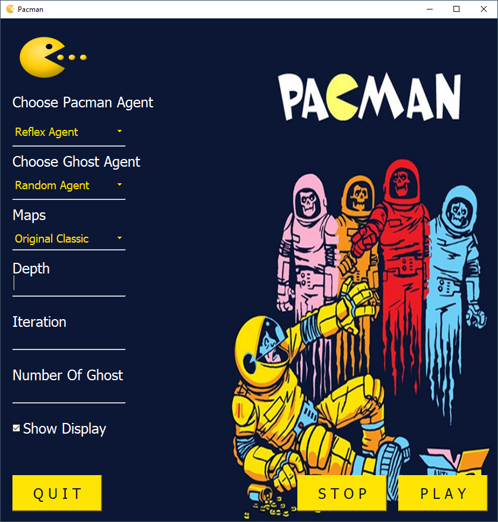
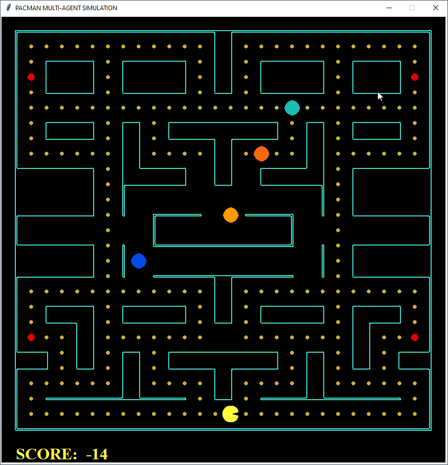
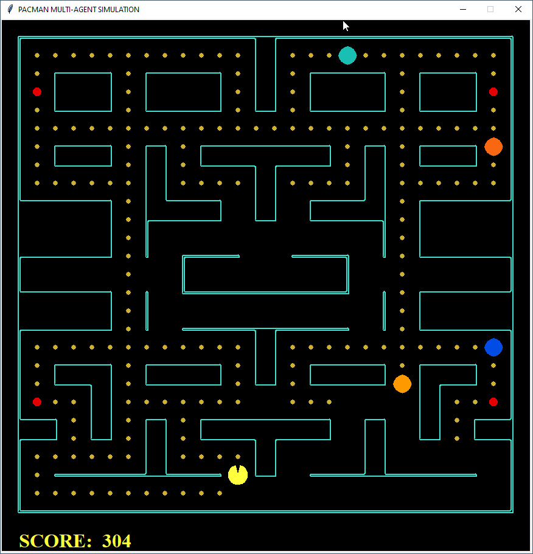
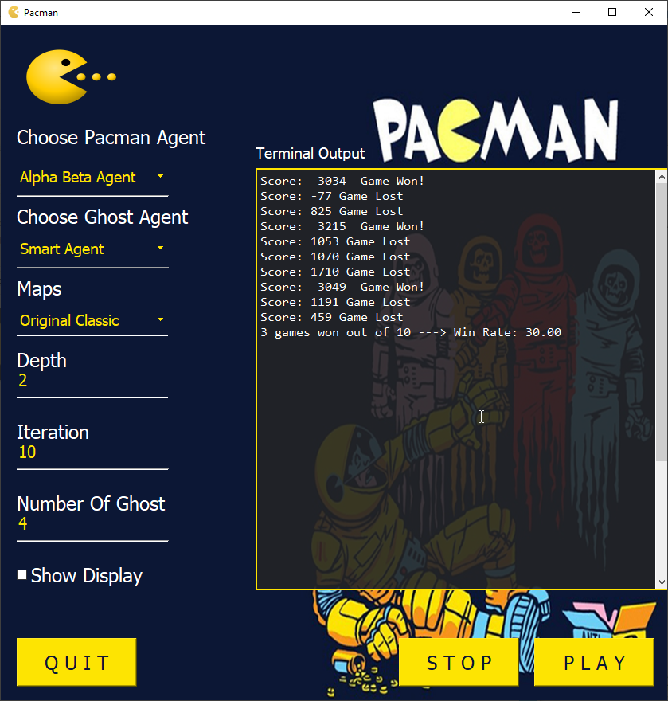

# Pacman AI in python

This Pacman Ai is made On **Python 3.7** 

## Features

1. GUI based menu
2. Pacman Game
3. Reflex Pacman Agent
4. Alpha-Beta Pacman Agent
5. ExpectiMax Pacman Agent
6. MinMax Pacman Agent
7. Random/ Smart Ghost Agent
8. 10 Maps
9. Depth Selection
10. Iteration Selection
11. Number of Ghost Selection
12. Auto Result Output Without Display

## Images

  
  
  
  
  